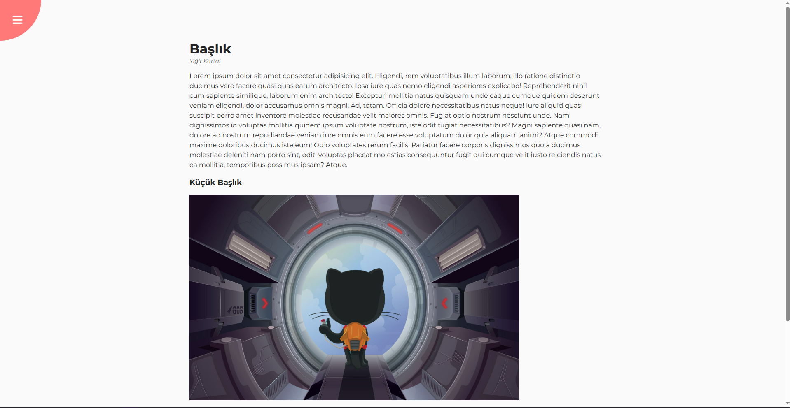
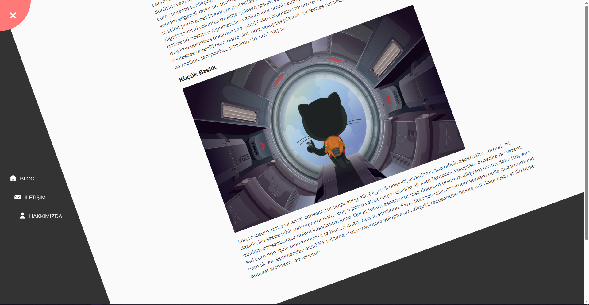

# 🎡 Rotating Navigation

A simple **Rotating Navigation Animation** built with HTML, CSS, and JavaScript.
When you click the button, the page and navigation rotate smoothly to show or hide the menu.
Clean, minimal, and fully responsive.

---

## 🖼️ Preview

<p align="center">
  
  
</p>

## 🚀 Features

* Smooth rotating navigation animation
* Modern UI using Inter font
* Fully responsive layout
* Clean and simple code
* Built with **HTML**, **CSS**, and **JavaScript** only

---

## ⚙️ Installation

Clone the repository:

```bash
git clone https://github.com/yigitkagankartal/rotating-navigation.git
```
